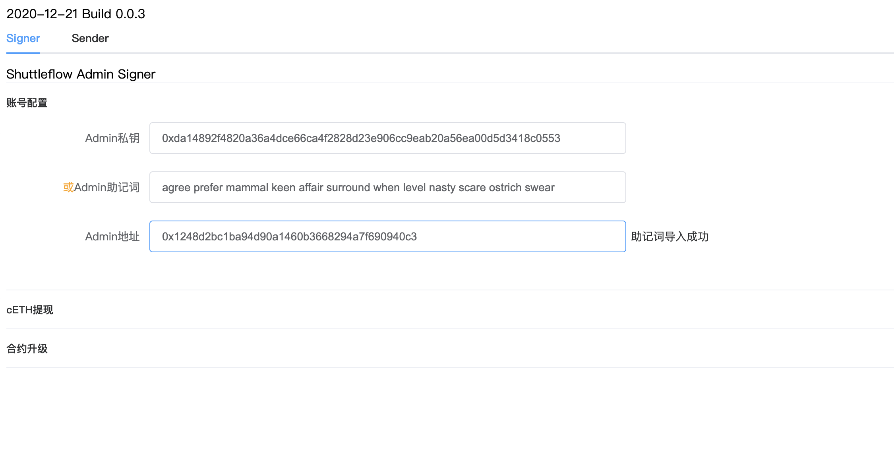
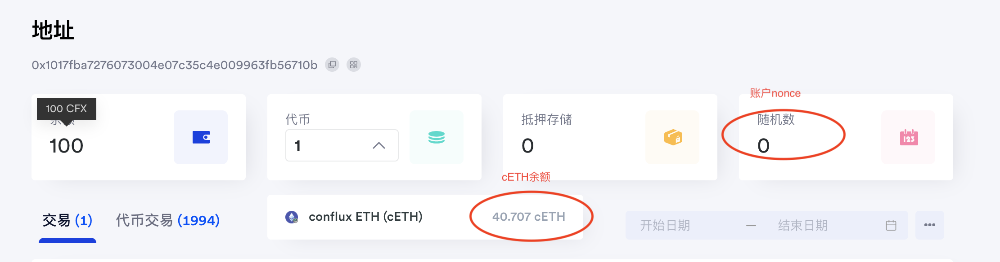
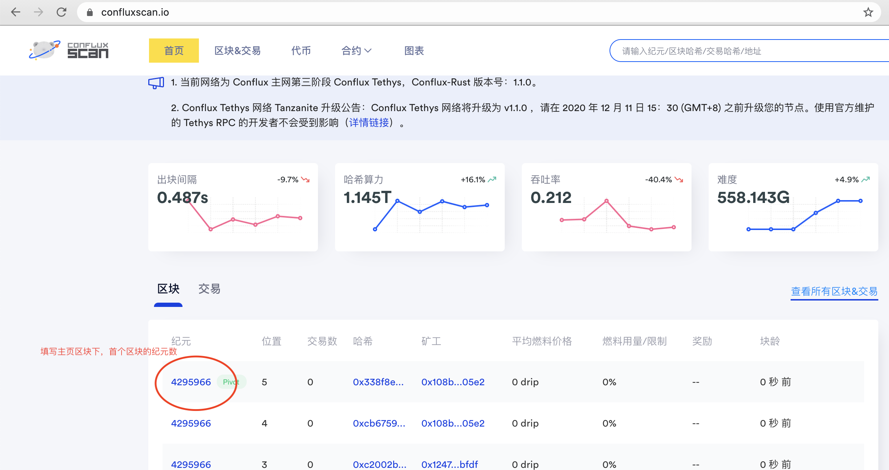
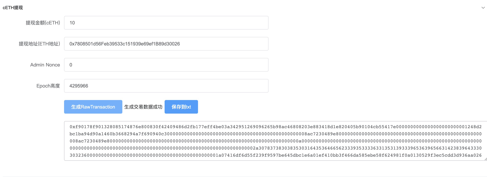

Shuttleflow Admin Tool使用方法：

解压后点击index.html，打开联盟成员签名工具。

工具分为2个标签页：

- Signer: 用于联盟成员用冷私钥签名。请确保使用这个页面下的功能时机器没有触网。

- Sender：用于发送Signer页面签名好的Raw Transaction，使用此页面功能时需要联网，建议不要与用Signer时使用的机器相同。

功能描述：

- 导入Admin私钥或助记词

打开Signer页面，填入私钥或助记词，点击*Admin地址*，将自动显示对应的Conflux地址，确认其与预期的地址相同：

- 提现账户中的cETH到eth主网

在导入了私钥或助记词且确认地址无误之后，点击cETH提现，填写如下信息：

1. 提现金额：希望提现的cETH数量（单位是cETH），账户金额可以去confluxscan上查看，例如https://confluxscan.io/address/0x1017fba7276073004e07c35c4e009963fb56710b?accountAddress=0x1017fba7276073004e07c35c4e009963fb56710b

2. 提现地址：希望提现ETH到ETH主网的地址

3. Admin Nonce：Conflux网络上Admin地址当前的nonce，同样可以在confluxscan上查看。

4. Epoch高度：填写当前Conflux网络的Epoch Number（用于构造Conflux交易），该值可以在confluxscan的首页查询，填写最新区块的纪元数即可。

全部填写完毕后，点击生成RawTransaction，并将其复制出来或下载保存：

- 合约升级：

填写升级合约地址、合约Nonce（由Shuttleflow研发人员告知），导出签名即可。

- 发送RawTransaction：

1. 保证机器已经连网，点击Signer标签页，填入导出的RawTransaction，点击发送。

2. 点击刷新追踪交易状态。